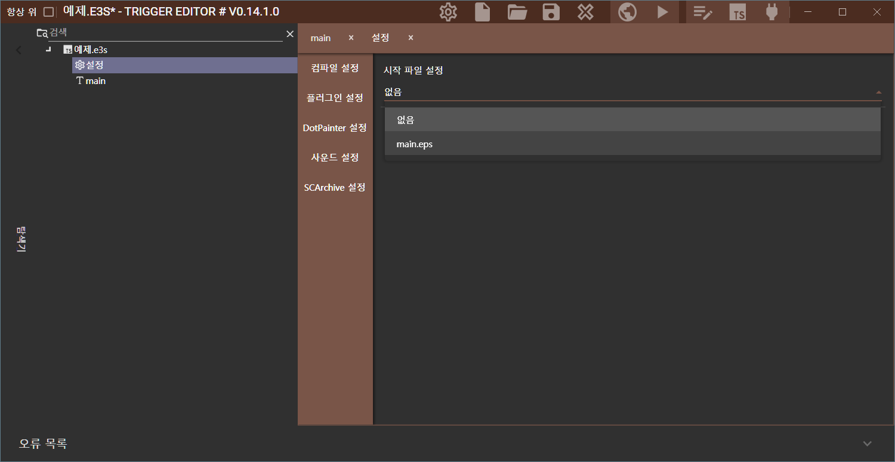

# 개발환경

epScript를 활용하기 위한 개발환경을 구축하는 방법에 대해서 설명합니다.

## 다운로드

사용할 툴은 아래와 같습니다. 다운로드는 [링크](/Other/Utility/)에서 받을 수 있습니다.

- EUD Editor3
- VS Code
- EUD Draft

## 새 프로젝트 생성하기

<mark>EUD Editor3</mark>에서 새로운 프로젝트를 생성합니다. :fontawesome-solid-gear:설정으로 들어가서, **[임시 파일 위치]**를 <mark>세이브파일폴더</mark>로 지정합니다. 그리고 **[연결된 맵]**에는 사용할 맵파일, **[저장맵]**은 빌드한 맵파일의 생성위치와 파일명을 지정합니다.


---

**[Trigger Editor]**로 가서, 생성되어 있는 <mark>main(클래식 트리거)</mark>를 삭제하고 다시 새롭게 <mark>main(epScript 파일)</mark>을 생성합니다.


---

main.eps에 가장 기본적인 <mark>onPluginStart</mark>, <mark>beforeTriggerExec</mark>, <mark>afterTriggerExec</mark> 함수를 선언해줍니다. 함수에 대해서는 다른 파트에서 자세히 설명합니다.

```js title="main.eps"
function onPluginStart() {
    
}

function beforeTriggerExec() {
    
}

function afterTriggerExec() {
    
}
```


---

<mark>Trigger Editor</mark> 안의 :fontawesome-solid-gear:설정으로 이동해서, **[시작 파일 위치]**를 새로 생성한 main.eps로 지정합니다.



---

:fontawesome-solid-play: **빌드** 버튼을 누르세요. 그러면, EUD Editor3에서 설정된 내용을 바탕으로 <mark>프로젝트 폴더</mark>가 생성됩니다. </mark>프로젝트(.e3s) 파일</mark>이 있는 폴더로 가보시면, 다음과 같이 **[BuildData_프로젝트명]** 폴더가 생성된 것을 알 수 있습니다.


---

이제, <mark>VS Code</mark>로 프로젝트 폴더를 열어줍니다. **[File]** > **[Open Folder...]** 순서로 가서 e3s파일과 프로젝트 폴더가 있는 폴더를 선택합니다.


---

폴더열기까지 했다면, 거의 다 끝났습니다.  
이제부터 새로운 <mark>epScript 파일</mark>을 추가할 때는 EUD Editor3가 아닌, **VS Code**에서 진행하게 됩니다.

```
BuildData_프로젝트명\eudplibData\TriggerEditor
```

eps파일을 추가할 땐 위의 경로 안에서 작성합니다. 실제로 아까 EUD Editor3에서 추가했던 `main.eps` 파일이 해당 경로에 생성되어 있음을 확인할 수 있습니다.


## 부록

!!! question "VS Code에서만 epScript파일을 생성하는 이유"

    `main.eps`만 EUD Editor3에서 생성하고 `그 외의 eps파일`은 <mark>VS Code</mark>에서만 생성하라고 한 이유는 뭘까요?  

    그 이유는 EUD Editor3에서 생성한 eps파일은 해당 에디터에서 관리하는 파일이 되어, 외부 환경(`VS Code나 직접 폴더로 접근`)에서 수정, 삭제가 불가능합니다. 여기서 가장 중요한 건 <mark>수정</mark>도 불가능하다는 점인데요. <mark>VS Code</mark>와 같은 외부 에디터로 코드를 작업해야 하는데 EUD Editor3가 이를 방해하는 셈입니다.  

    하지만 epScript에서는 프로그래밍 언어처럼 `import`를 지원합니다. main.eps에서 `import 다른파일명;`과 같이 작성하면 main.eps에서 다른 eps파일을 불러올 수 있게 됩니다. 이를 활용해서 main.eps에만 EUD Editor3에 종속되게 하고 그 외의 파일은 직접 생성해서 연결하면 <mark>VS Code</mark>에서도 epScript를 작업할 수 있는 환경이 마련됩니다.

!!! question "EUD Editor3의 연결 기능"

    EUD Editor3에는 외부파일을 활용하여 개발하고자 하는 분들을 위한 <mark>연결</mark>기능이 존재합니다. 하지만, 해당 기능을 활용한다고 해도 번거롭다는 한계에서 벗어나기가 어렵습니다.  

    1. 매번 새로운 외부파일을 생성할 때마다 별도로 EUD Editor3에서 eps파일 생성 후 <mark>연결</mark>을 해줘야 합니다.
    2. 외부파일의 위치나 피일명이 변경되면 매번 새롭게 연결해야 합니다.
    
    위의 2가지 단점으로 저는 main.eps만 종속시키고 나머지는 import로 불러오는 방식으로 강의를 진행합니다.