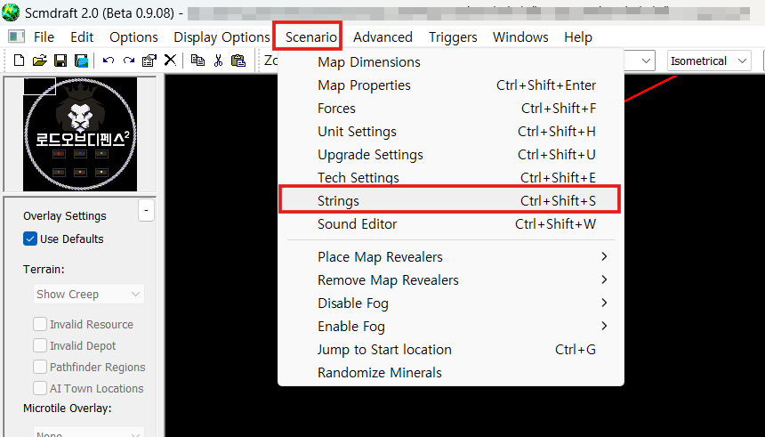
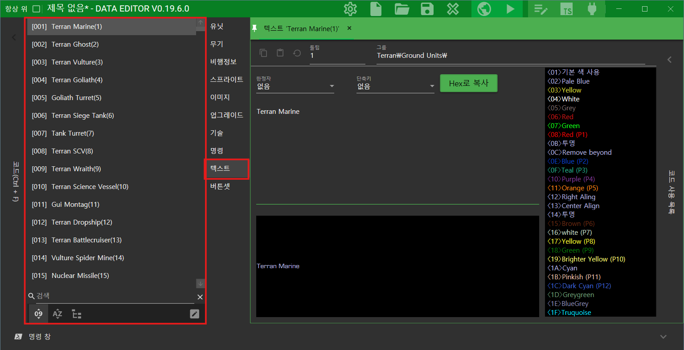

# String

스타크래프트1 유즈맵을 제작할 때는 게임을 플레이하는 유저에게 정보를 제공하기 위한 수단으로 텍스트가 매우 중요합니다. 하지만, 유즈맵 개발시 텍스트의 타입이 여러종류로 나뉘기 때문에 제대로 개념을 잡지 않고 넘어간다면 매우 어렵고 헷갈릴 수 있는 부분입니다.

텍스트는 그 종류에 따라, 아래와 같은 이름을 붙여봤습니다.

- Map String
- Tbl Text
- Db String

이제부터 하나씩 그 개념에 대해서 알아봅시다. 해당 파트에서는 설명을 위해 아직 등장하지 않은 개념(메모리 주소)이 등장합니다.

## Map String

먼저, <mark>Map String</mark>입니다. Map String은 가장 기본적인 스트링입니다. 흔히, 세디터나 SCM Draft2, 스타포지와 같은 클래식한 에디터에서도 접할 수 있습니다.

<mark>Map String</mark>은 스타크래프트 유즈맵에서 텍스트 정보를 출력하기 위해 관리하는 데이터입니다. 유즈맵 제작자가 수정한 유닛의 이름이라던지, 맵제목, 맵설명, 포스이름, 로케이션 이름, DisplayText 트리거로 작성한 텍스트 등 클래식에디터에서 작성한 모든 텍스트 데이터가 여기에 해당합니다.

{ width="450" }
{ width="300" }

위의 스크린샷은 `SCM Draft2`에서 Map String을 볼 수 있는 방법입니다.

!!! tip "유닛이름은 Map String이 될수도 있고, Tbl Text가 될수도 있다."

    유닛이름은 조금 특이한 케이스입니다.

    클래식에디터에서 유닛이름을 변경하면, 이는 <mark>Map String</mark>이 됩니다. 하지만, 유닛이름을 변경하지 않은 기본값 상태는 stat_text.tbl에 위치한 <mark>Tbl Text</mark>에 해당합니다.

## Tbl Text

<mark>Tbl Text</mark>는 `stat_text.tbl` 파일에서 관리되는 텍스트 데이터입니다. 유닛의 기본이름, 인공지능 텍스트, 버튼셋 텍스트, 무기, 업그레이드, 테크 이름 등이 여기서 관리됩니다.

Tbl Text를 수정한다는 건 `stat_text.tbl` 파일을 수정해서 덮어씌우겠다는 뜻과 같습니다. 그리고 이런 작업은 <mark>EUD</mark>의 영역이죠. 그래서 Tbl Text를 확인하고 싶다면, 맛있는빙수님의 `EUD Editor`에서 확인할 수 있습니다.



!!! tip "EUD Editor에서 유닛이름을 수정하는 건 stat_text.tbl을 수정하는 것과 같다."

    위에서 유닛이름의 기본값은 <mark>Tbl Text</mark>에 해당한다고 이야기했습니다. 그리고 클래식에디터가 아닌 EUD Editor에서 유닛이름을 수정하면, 이는 `stat_text.tbl`에서 유닛의 기본이름을 수정하는 것과 같습니다.

    여기서 `stat_text.tbl`을 수정하게 되면, 아래와 같은 주의사항이 존재합니다.

    - stat_txt.tbl 사용하면 커스텀 단축키 사용 불가능 [[출처]](https://cafe.naver.com/edac/123132)
        * 생컨, 랜능크, 영밀돕 같은 밀리 기반 유즈맵에선 유저 커스텀 단축키를 지원해야 되는데 TBL을 1개라도 건들면 TBL 사용맵이 되서 유저 단축키 대신에 TBL에서 정해준 단축키를 써야만 합니다.
        * 커스텀 단축키를 EUD로 알아내는 건 불가능해서 TBL과 커스텀 단축키 둘 중에 선택해야 합니다.

## Db String

<mark>Db String</mark>은 Eudplib, epScript와 같이 EUD를 사용해서 스타크래프트 메모리에 텍스트 데이터를 할당하는 방식입니다. 그렇기에, `DisplayText`와 같은 클래식트리거에서는 Db String을 넣어줘도 출력되지 않고 컴파일 오류가 발생합니다.

<mark>Db String</mark>은 EUD에서 사용하기 위한 방식으로, 보통 `stat_text.tbl`을 수정할 수 있는 settblf, StringBuffer와 같은 EUD트리거 쪽에서 사용합니다[^1].

대부분의 경우에서 Db String을 클래식트리거와 연계해서 사용할 수 있게 만들어져 있어서 Db String 형태로 텍스트를 선언하고 활용하게 됩니다.

```js
const text = Db("안녕하세요. Db String 예시입니다.");
```

보통 위와 같이 `Db("텍스트내용")`[^2] 형태로 선언합니다. 이렇게 코드로 선언이 가능하기 때문에, 텍스트와 관련된 다양한 응용이 가능하게 됩니다.


[^1]: Db String도 StringBuffer의 stringIndex를 활용하면, 클래식트리거에서도 출력이 가능합니다. 이는 나중에 라이브러리 파트의 <mark>StringBuffer</mark>에서 자세히 설명합니다.
[^2]: Db 객체는 바이너리 데이터를 메모리에 올리기 위한 객체입니다. 그래서 `Db(바이트크기)` 형태로 사용도 가능하며, 바이트크기 대신 텍스트가 들어가면 텍스트가 차지하는 공간 크기만큼 내부적으로 공간을 할당받고 해당 공간은 텍스트데이터(utf-8)로 초기화됩니다.