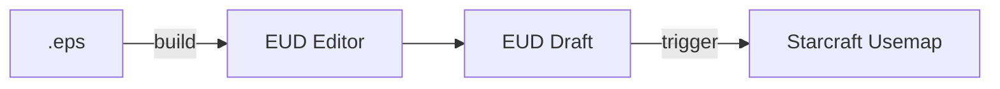
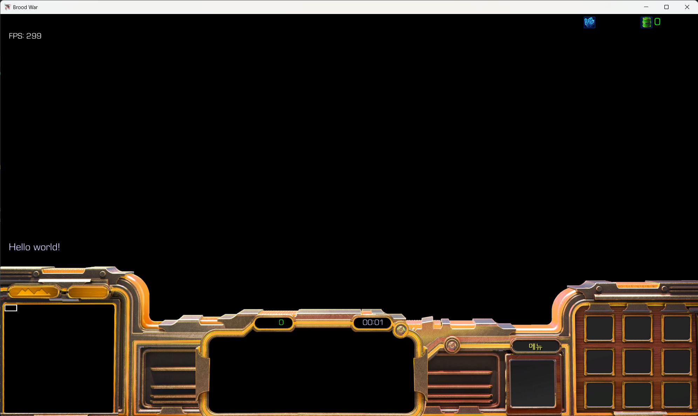

# 프로젝트 빌드

간단하게 EUD맵에서 빌드에 대한 개념과 실제 빌드 후 유즈맵을 실행하여 결과를 확인합니다.

## 빌드란?

빌드는 <mark>스크립트 코드(.eps)를 트리거[^1]로 변환하여 스타크래프트 맵파일(.scx)에 삽입하는 과정</mark>을 의미합니다. 다시 말해, 작성한 코드 파일을 맵에 반영하기 위한 과정입니다.




## 빌드하기

EUD Editor 2 또는 3을 사용 중이라면,  <mark>빌드 과정</mark>은 매우 간단합니다. :fontawesome-solid-play: 아이콘 모양의 **빌드** 버튼을 클릭하기만 하면 됩니다. 이때, `[연결된 맵]으로 지정한 .scx 맵파일`을 복사한 뒤, 해당 복사본에 트리거로 컴파일된 코드를 삽입하고, `[저장맵] 경로`에 내보냅니다.  

간단하게 테스트를 위해, `main.eps`에 아래의 코드를 복사해서 넣어봅시다. 해당 코드는 게임중인 모든 플레이어에게 "Hello world!"를 출력하는 단순한 코드입니다.

```js title="main.eps"
function onPluginStart() {
    foreach(cp : EUDLoopPlayer()) {
        setcurpl(cp);
        DisplayText("Hello world!");
    }
}
```

코드를 붙여넣었다면, 직접 빌드 버튼을 눌러봅시다. [저장맵]으로 지정했던 경로에 맵파일을 스타크래프트에서 실행할 수 있게 다음 위치로 옮깁니다.

1.`<스타크래프트 설치경로>\Maps`  
2.`C:\Users\<사용자계정명>\Documents\StarCraft\Maps` -- 내문서

## 확인하기

이제, 직접 빌드했던 EUD맵을 확인해봅시다. `Hello world!`가 잘 출력되었네요.



[^1]: 여기서 말하는 트리거는 SCM Draft2와 같은 기본에디터에서 볼 수 있는 트리거가 아닌 EUD(Extended Unit Death)로 보안취약점을 이용한 프로세스 내부의 메모리를 변조하는 기술이 들어갑니다. 하지만, 이를 직접 다뤄서 변수나 if, while 같은 기능을 직접 만드는 건 매우 어렵고 이를 위해 `Eudplib`과 `Epscript`가 나왔습니다.