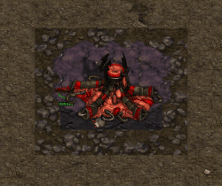
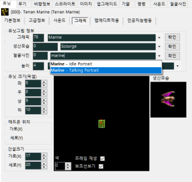
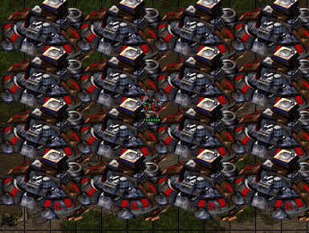
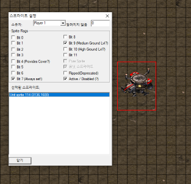

# 점검 가이드

해당 페이지는 제가 작성했던 [맵만들면서 오류나거나 팅기는 원인들](https://cafe.naver.com/edac/91492) 게시글의 내용을 조금 더 보기 좋게 개선한 버전입니다.

## 오류 유형

| 유형        | 설명                                        |
|-----------|-------------------------------------------| 
| 오류 (팅김)   | 스타크래프트가 팅기고 오류창이 뜨는 상황                    |
| EUD ERROR | 미지원 오프셋에 접근하여 발생하는 상황 (보통 구조오프셋때문에 발생)    |
| 방갈림       | 다른 유저들이 전부 Drop 되고 혼자 남게 되는 상황            |
| 프리징       | 스타크래프트의 화면이 멈추고 응답없음 상태로 변하는 상황           |
| 고인돌       | 없는 이미지를 불러올 경우 0번 이미지인 고인돌 이미지가 맵에 생기는 현상 |

### 유형. 오류 (팅김)

| 번호 | 설명                                                                                                                                                                                                                                         |
|---:|--------------------------------------------------------------------------------------------------------------------------------------------------------------------------------------------------------------------------------------------| 
| 1. | 맵의 최외각 경계에 건물이 걸쳐있는 경우                                                                                                                                                                                                                     |
| 2. | 건물체력을 0으로 설정한 상태에서 건설한 경우                                                                                                                                                                                                                  |
| 3. | 비리마스터환경에서 유닛화한 131(해처리)~227(가스)을 드래그하여 다수의 유닛을 선택할 경우                                                                                                                                                                                      |
| 4. | 파괴 모션이 없는 스크립트를 사용하는 유닛을 사용할 경우 스프라이트가 계속 쌓여서 팅기는 오류                                                                                                                                                                                       |
| 5. | 고스트유닛(1, 16, 99, 100, 104)에 단일개체 속성이 체크된 상태에서 유닛이 사라질 경우 (트리거에 의한 Remove, Kill 혹은 유닛에게 파괴당하는 경우 모두 포함.) > 해결방법 [Xenon님 글](https://cafe.naver.com/edac/126815) (<mark>:fontawesome-solid-code: 아레치투</mark>님 제보)                     |
| 6. | 버튼셋에서 사용가능 문자열을 비워둔 경우(0, None 상태) (64비트만 해당)                                                                                                                                                                                              |
| 7. | MSQC의 인식유닛(기본값:Terran Valkyrie)의 데이터를 EUD로 건드린 경우, 삭제, 파괴한 경우                                                                                                                                                                              |
| 8. | 구조오프셋 조정으로 유닛의 현재체력이 최대체력값보다 크게 높은 경우 (확률, 건물은 불, 피흘리는 모션때문에 팅김)                                                                                                                                                                           |
| 9. | 에디터로 미리 배치된 유닛의 크기를 EUD로 변경한 상태에서 다른 유닛과 닿았을 경우                                                                                                                                                                                            |
| 10. | 리마스터에서 추가된 지형을 삽입한 맵파일을 구버젼 SCM Draft 2로 열어서 저장한 경우                                                                                                                                                                                        |
| 11. | 3종족 일꾼, 3종족 가스 건물, 중립가스(자원), 탱크, 골리앗, 레이스, 베슬, 배틀, Unused쪽에 있는 아칸 공격 명중 이미지를 사용하지 않는 유닛에게 부가유닛을 단 경우                                                                                                                                       |
| 12. | 구조오프셋으로 유닛의 소유 플레이어(0x4C)를 강제로 변경한 후 그 유닛이 리무브 혹은 파괴될 경우                                                                                                                                                                                   |
| 13. | 핵공격에 피격당하고 있는 유닛의 최대체력을 수정한 경우                                                                                                                                                                                                             |
| 14. | 실드(shield) 관련 스크립트가 없는 이미지에게 실드를 준 상태에서 피격을 당한 경우 (<mark>:fontawesome-solid-code: Dtime</mark>님 제보) > 실드 애니메이션을 재생해야 하는데 관련 스크립트가 없어서 오류 발생하는 걸로 추정, 아래의 이미지와 같이 스크립트 내에 Init, Death 2개 밖에 없는 케이스가 해당      |
| 15. | 회전반경이 0인 유닛이 이동 중에 멈춘 경우 > 공중유닛화 + noAirCollision함수를 사용하면 문제해결가능                                                                                                                                                                       |
| 16. | 탱크의 부가유닛(터렛)부분을 변경한 상태에서 시즈모드 버튼을 누른 경우                                                                                                                                                                                                    |
| 17. | 대기열인식을 유닛생산이 가능한 건물에서 사용한 경우 (유닛인덱스가 계속 누적, 캔낫을 일으킴) > 해결방법 [건물의 대기열인식 초기화방법](https://cafe.naver.com/edac/93719)                                                                                                                       |
| 18. | 저그유닛을 생산 중인 Zerg Egg에게 기브트리거를 사용하는 경우 (<mark>:fontawesome-solid-code: 버터쿠키</mark>님 제보)                                                                                                                         |
| 19. | 건물의 인공지능 탭에서 "Guard"상태가 되지 않는다.를 체크해제한 상태에서 플레이어가 해당 건물을 소유한 경우                                                                                                                                                                            |
| 20. | 건물의 버튼셋에 stop reaver, stop carrier를 넣어두고 64비트 스타에서 버튼을 누른 경우 (64비트만 해당)                                                                                                                                                                    |
| 21. | 건물의 그래픽에 초록색을 입힌 경우(스타꺼짐, 꼭 팅기는건 아니고 특정건물에서 발견됨 ex.오버마인드, 다고스?) > 초록색 그래픽 만드는 방법 [링크참고](https://cafe.naver.com/edac/81406), 버그제보 [링크](https://cafe.naver.com/edac/108451)                                                              |
| 22. | 기술 사용조건에 "is researched..."를 추가하고 해당기술을 가진 유닛을 클릭한 경우 (32비트만 해당) (<mark>:fontawesome-solid-code: 클릭</mark>님 제보)                                                                                                                            |
| 23. | 유닛의 얼굴사진(포트레잇)을 Talking Portrait으로 설정하고 해당 유닛을 클릭한 경우 [출처](https://cafe.naver.com/edac/112700) (<mark>:fontawesome-solid-code: 2354</mark>님 제보)                                                                |
| 24. | 파일런을 제외한 다른 건물의 인공지능을 164번 Initing Psi Provider로 지정할 경우 (<mark>:fontawesome-solid-code: 택하이</mark>님 제보)                                                                                                                                    |
| 25. | 이미지의 스크립트로 181번 Pylon 스크립트를 사용한 상태에서 기브트리거를 사용할 경우 (<mark>:fontawesome-solid-code: 믹넛</mark>님 제보)                                                                                                                                          |
| 26. | 오버로드, SCV, 드론, 프로브의 인공지능에서 Guard 상태가 되지 않는다를 체크해제한 경우 (<mark>:fontawesome-solid-code: 알타</mark>님, <mark>:fontawesome-solid-code: 맛빙</mark>님 제보) > 체크해제한 상태에서 컴퓨터가 소유한 해당유닛들이 사망할 경우 팅긴다고 합니다. [출처](https://cafe.naver.com/edac/110886) |
| 27. | 유닛크기가 0,0,0,0 인 경우 [출처](https://cafe.naver.com/edac/92015)                                                                                                                                                                                 |
| 28. | 단일타겟에 "타겟유닛으로 발사(1)"방식의 무기의 투사체가 첫번째 타겟보다 두번째 타겟에게 먼저 도달한 경우 (<mark>:fontawesome-solid-code: 디펜더</mark>님 제보)                                                                                                                               |
| 29. | 건물이 맵 밖으로 배치된 경우 (64비트만 해당) (<mark>:fontawesome-solid-code: 알타</mark>님 제보)                                                                                                                                                                 |
| 30. | 맵리빌버를 배치할 공중 공간이 없는 경우 [출처1](https://cafe.naver.com/edac/131642)[출처2](https://cafe.naver.com/edac/131635) (<mark>:fontawesome-solid-code: Terran Wraith</mark>, <mark>:fontawesome-solid-code: 알타</mark>님 제보)  |
| 31. | 버튼셋 228번에 버튼을 하나라도 추가한 경우 (<mark>:fontawesome-solid-code: 버터쿠키</mark>님 제보)                                                                                                                                                                 |
| 32. | 보는 방향이 알아서 바뀌는 유닛 (가만히 있으면 뒤척이는 마린, 고스트, 케리건 등)의 스프라이트를 배치하면 게임 시작 2초 뒤 튕깁니다. (<mark>:fontawesome-solid-code: 디펜더</mark>님 제보)                                                                                                              |

### 유형. EUD ERROR

| 번호 | 설명                                                                                                                 |
|---:|--------------------------------------------------------------------------------------------------------------------| 
| 1. | 배열에서 없는 인덱스를 참조할 경우 (배열오버플로우, 랜덤한 곳에서 트리거 정지가 발생) > e.g. `const array = EUDArray(8); simpleprint(array[11]);` |
| 2. | 변수에 ptr이나 epd 정보가 담기지 않은 상태에서 참조할 경우 |
| 3. | ptr, epd 정보가 가리키는 유닛이 맵상에서 사망한 상태에서 참조할 경우 |
| 4. | 한글이름의 사운드(wav,ogg 둘다)를 넣고, EUD Editor를 통해 컴파일한 경우 |

### 유형. 방갈림

| 번호 | 설명                                                                                                                                                                                               |
|---:|--------------------------------------------------------------------------------------------------------------------------------------------------------------------------------------------------| 
| 1. | 비공유 조건으로 공유 액션을 실행할 경우 > [비공유 클릭인식 사용](https://cafe.naver.com/edac/76366), [비공유 채팅인식 사용](https://cafe.naver.com/edac/39312), [비공유 키인식 사용](https://cafe.naver.com/edac/53641) 등과 같은 비공유 트리거 관련 |
| 2. | Terrain Palette에서 Tilset Indexed의 제일 첫번째 검은 지형(0,0)을 사용한 경우                                                                                                          |
| 3. | 유닛 스프라이트의 Active / Disabled(?)를 체크한 스타포트를 맵에 배치한 경우                                                                                                                  |
| 4. | 건물판정에 외형은 건물이 아닌 다른 그래픽을 사용하는 유닛은 안개에 남게 될 경우 (<mark>:fontawesome-solid-code: 택하이</mark>님 제보) > 도어류 유닛은 exe영역으로 안개에서는 건물처럼 잔상이 남아서 방갈림 유발 가능 [출처1](https://cafe.naver.com/edac/114919)[출처2](https://cafe.naver.com/edac/130913)                                  |

### 유형. 프리징

| 번호 | 설명                                                                                                                                               |
|---:|--------------------------------------------------------------------------------------------------------------------------------------------------| 
| 1. | While문을 사용할때, 조건이 계속 True(참)인 경우 > e.g. `while(1) {simpleprint("while의 조건이 1이므로 탈출이 불가능한 조건입니다.");}`                                         |
| 2. | 수백마리의 아비터가 뭉친 곳에 어떤 유닛이 클로킹되거나 해제되는 경우 (확률적) (<mark>:fontawesome-solid-code: HiroGS</mark>님 제보) > 칼리즈 크리스탈을 든 일꾼이 아비터가 뭉친 곳에 지나가면 팅김. [출처](https://cafe.naver.com/edac/112723) |

### 유형. 고인돌

| 번호 | 설명                                                                                                                                               |
|---:|--------------------------------------------------------------------------------------------------------------------------------------------------| 
| 1. | 이미지의 스크립트를 변경했을 때, 없는 프레임을 스크립트가 요구해버리는 경우(BLANK가 뜨면 해당) |
| 2. | 타겟 방향 자동 공격, 공중유닛, 높이 공중, 건설크기 0,1, 외형이 미사일트랩인 유닛이 다른 유닛과 겹친 경우 (<mark>:fontawesome-solid-code: 김묵자</mark>님 제보) |

### 유형. 기타

| 번호 | 설명                                                                                                                                          |
|---:|---------------------------------------------------------------------------------------------------------------------------------------------| 
| 1. | EUD에디터2의 요구사항에서 무조건 허용을 사용한 경우 > 버튼의 경우 연타시 사라짐.                                                                                        |
| 2. | 에디터로 띄운 건물을 배치했을 경우 > MSQC 작동 안됨, 트리거로 띄워서 생성한 건물은 상관없음.                                                                                |
| 3. | SetPName 함수를 beforeTriggerExec()에 넣은 경우 > chatEvent플러그인이 작동 안함. afterTriggerExec() 쪽으로 옮겨야 정상 작동.                                       |
| 4. | SCM Draft2에서 확장자명을 "StarCraft Remastered Brood War Map (.scx)" 로 저장한 후, EUD Editor2로 여는 경우 > EUD Editor2에서 스트림의 끝을 넘어 읽을 수 없습니다. 오류창 뜸. |